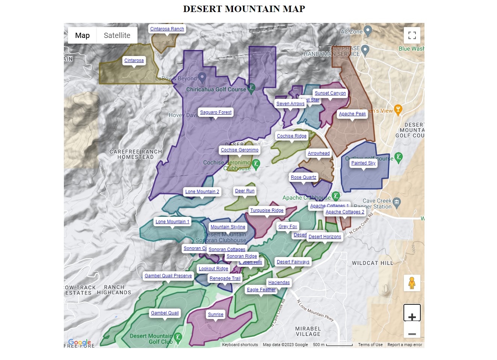

# google-maps-generator

<p align="center">

</p>

## Table of Contents

- [google-maps-generator](#google-maps-generator)
  - [Table of Contents](#table-of-contents)
  - [About](#about)
  - [Prequisistes](#prequisistes)
  - [Generating a Map](#generating-a-map)
  - [Development](#development)
  - [Building](#building)
  - [Unit Testing](#unit-testing)
  - [Integration Testing](#integration-testing)

## About

This repo is a Google Maps Generator that allows you to outline various regions with a drawn polygons and links. This application is written entirely in <a href="https://www.typescriptlang.org/">TypeScript</a> and utilizes <a href="https://en.wikipedia.org/wiki/JSON">JSON</a>, <a href="https://sass-lang.com/">SCSS</a>, and <a href="https://handlebarsjs.com/">Handlebars</a> to generate the browser based map. <a href="https://webpack.js.org/">Webpack</a> is used to generate the bundle consisting of an `index.html` file, a `map.js` file, and a `map.css` file. The map generated will appear as show below:



## Prequisistes

1. You must get a Google Maps Api key. You can do so from [Google Cloud Console](https://console.cloud.google.com/)
2. You must restrict you API key to include your testing URLs (`http://localhost:9000` and any other) and your Production URLs. You can do so from [Google Cloud Console](https://console.cloud.google.com/)
3. You must fill out the `.env` file to include the Google Maps Api Key as well as any other values included

## Generating a Map

This repo Generates a map like as show above.

The maps generated are created from <a href="https://en.wikipedia.org/wiki/JSON">JSON</a> data found in the `src/data` directory. You will find this repo capable of generating 3 maps, which is why there are 3 directories (`desert-mountain`, `north-scottsdale`, and `the-valley`) found within. In order to add another map, you must replicate the structure of these directories. In each, there are two files:

1. `areas.json`
2. `map.json`

The `areas.json` file is a collection of longitude and latitude coordinates responsible for drawing the individual polygons, as well as it's link and label shown on the map. In order to generate this file, you must go to (https://www.google.com/maps/d/)[https://www.google.com/maps/d/] and click "create a new map." It is there that you add layers and draw your polygons on the map. The colors of the polygons you draw here are NOT the colors that the generated maps will have. The colors are done separately in the code, found in the file `src/ts/utils/get-polygon-colors.ts`. Once you have draw your polygons, export the data to get your Latitude and Longitude points. Personally, I would export the data as `CSV` and then use [Visual Studio Code](https://code.visualstudio.com/) to tranform the data into `JSON` by hand. But there are also many online conversion tools. For example, you could export the data as `KML` and then use a [KML to LatLong Online Converter](https://mygeodata.cloud/converter/kml-to-latlong) to get your Latitude and Longitude points.

The `map.json` file on the other hand is much more easy to create. Again, go to (https://www.google.com/maps/d/)[https://www.google.com/maps/d/]. Instead of drawing polygons, this time you will only need a single point: the center of the map. Simply get that point, and transform it into the appropriate json.

Once you have both your `areas.json` and `map.json` files, you will need to place them in a directory under `src/data/[YOUR_MAP_NAME_HERE]`. The name you choose is important, and will be used in the next step.

Finally, take the name of your map (`src/data/[YOUR_MAP_NAME_HERE]`) and go to the `.env` file. Modify the `MAPS` value to include your map name (i.e. `MAPS=[your_map_name_here]:[some_number_here]`, for example: `MAPS=new-york-city:3`). The number you give your map doesn't not matter in the slightest, it just matters that the number is unique.

Lastly, to build your new map, you need to modify the `MAP_NUMBERS` variable in the `.env` file to include your new map number. For example, if in the previous step you did `MAPS=new-york-city:3`, then you should modify `MAP_NUMBERS` to be something like `MAP_NUMBERS="3"`. If you want to build multiple maps, you can include many numbers via comma separated values (i.e. `MAPS=1,2,3`)

And that is it! Next you need to either build your map, or serve it (commands show below).

## Development

To run and continually serve the generated maps on the development server, run...

```bash
npm run serve
```

## Building

To build the maps for production use, run...

```bash
npm run build
```

## Unit Testing

To run the unit tests, run...

```bash
npm run test:unit
```

## Integration Testing

To run the integration test, run...

```bash
npm run test:integation
```
